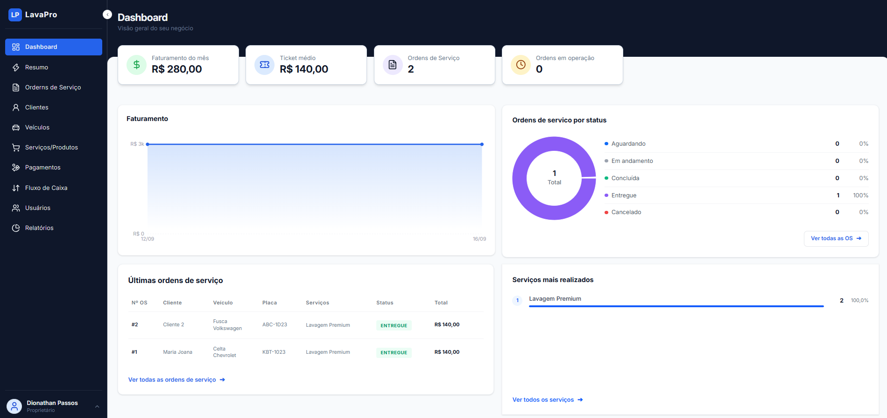
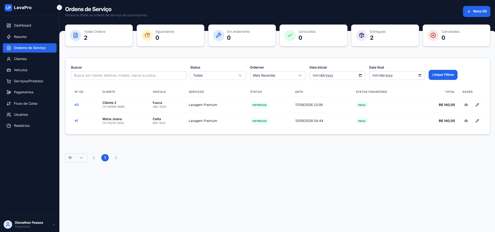

# LavaPro

Sistema de gestão para lava-rápidos, desenvolvido com **Java + Spring
Boot** no backend e **React + Vite** no frontend.

O projeto foi desenvolvido inicialmente como estudo e portfólio, com
foco em **desenvolvimento backend, regras de negócio, segurança,
organização arquitetural e integração entre API e aplicação web**. A
estrutura também permite uma futura evolução para um produto SaaS
comercial.

------------------------------------------------------------------------

## 📌 Sobre o projeto

O LavaPro permite controlar as principais operações de um lava-rápido em
um único sistema:

-   cadastro de clientes e veículos;
-   criação e acompanhamento de ordens de serviço;
-   catálogo de serviços e produtos;
-   controle de pagamentos;
-   fluxo de caixa;
-   dashboard e relatórios;
-   gerenciamento de usuários;
-   controle de acesso por perfil;
-   suporte a múltiplas empresas (multi-tenant).

O objetivo é representar um cenário próximo de uma aplicação real,
aplicando práticas utilizadas no desenvolvimento de APIs e sistemas web.

------------------------------------------------------------------------

## 🖥️ Demonstração

### Dashboard



### Ordens de Serviço



------------------------------------------------------------------------

## 🚀 Principais funcionalidades

### Autenticação e segurança

-   Login e registro de usuários;
-   autenticação utilizando JWT;
-   Spring Security;
-   controle de acesso por roles;
-   proteção de endpoints;
-   tratamento centralizado de exceções;
-   usuários ativos/inativos.

### Gestão operacional

-   clientes;
-   veículos;
-   serviços e produtos;
-   ordens de serviço;
-   controle de status da OS;
-   histórico operacional;
-   regras de transição de status.

### Financeiro

-   pagamentos;
-   métodos de pagamento;
-   cancelamentos e estornos;
-   fluxo de caixa;
-   faturamento;
-   ticket médio;
-   relatórios financeiros.

### Relatórios

-   visão geral;
-   relatório financeiro;
-   relatório operacional;
-   relatório de clientes;
-   evolução de atendimentos;
-   clientes recorrentes;
-   serviços mais realizados;
-   indicadores do período.

------------------------------------------------------------------------

## 🏗️ Arquitetura

O backend é organizado por **módulos/domínios**, mantendo as
responsabilidades separadas.

``` text
src/main/java
└── com.dionathan.lavapro
    ├── auth
    ├── company
    ├── user
    ├── customer
    ├── vehicle
    ├── serviceOrder
    ├── serviceCatalog
    ├── payment
    ├── cashFlow
    ├── report
    ├── dashboard
    ├── security
    └── common
```

Dentro dos módulos, as responsabilidades são separadas entre componentes
como:

``` text
Controller
    ↓
Service
    ↓
Repository
    ↓
Entity / Domain
```

As regras importantes de negócio permanecem próximas ao domínio,
evitando que o controller concentre responsabilidades.

------------------------------------------------------------------------

## 🔐 Multi-tenancy

O LavaPro foi estruturado para trabalhar com múltiplas empresas.

O usuário autenticado está associado a uma empresa e as consultas e
operações são realizadas considerando o contexto da empresa.

Conceitualmente:

``` text
Usuário
   ↓
Empresa
   ↓
Dados da empresa
   ├── Clientes
   ├── Veículos
   ├── Ordens de Serviço
   ├── Pagamentos
   ├── Fluxo de Caixa
   └── Usuários
```

Essa abordagem evita que usuários de uma empresa tenham acesso aos dados
de outra empresa.

------------------------------------------------------------------------

## 👥 Controle de acesso

O sistema utiliza **roles** para controlar o acesso às funcionalidades.

Exemplo:

``` text
OWNER
 ├── Dashboard
 ├── Operações
 ├── Financeiro
 ├── Relatórios
 └── Usuários

ADMIN
 ├── Dashboard
 ├── Operações
 ├── Financeiro
 └── Relatórios

EMPLOYEE
 └── Operações permitidas
```

O frontend controla a experiência de navegação, enquanto o backend
mantém a autorização real dos endpoints.

------------------------------------------------------------------------

## 🛠️ Tecnologias

### Backend

-   Java 21
-   Spring Boot
-   Spring Security
-   Spring Data JPA
-   Hibernate
-   JWT
-   MySQL
-   Maven

### Frontend

-   React
-   Vite
-   React Router
-   Axios
-   Tailwind CSS
-   Lucide React

### Infraestrutura

-   Docker
-   Docker Compose
-   Nginx

------------------------------------------------------------------------

## 📁 Estrutura do projeto

``` text
lavapro/
├── src/
│   ├── main/
│   └── ...
│
│
├── pom.xml
├── Dockerfile
├── docker-compose.yml
├── .gitignore
└── README.md
```

------------------------------------------------------------------------

## ⚙️ Como executar

### Pré-requisitos

-   Java 21
-   Maven
-   Node.js
-   npm
-   Docker e Docker Compose
-   MySQL (caso não utilize o container)

### Backend

Entre no diretório:

``` bash
cd backend
```

Execute:

``` bash
./mvnw spring-boot:run
```

No Windows:

``` bash
mvnw.cmd spring-boot:run
```

A API ficará disponível, por padrão, em:

``` text
http://localhost:8080
```

### Frontend

``` bash
cd frontend
npm install
npm run dev
```

O frontend ficará disponível, normalmente, em:

``` text
http://localhost:5173
```

------------------------------------------------------------------------

## 🔧 Variáveis de ambiente

Exemplo para o backend:

``` env
DB_URL=jdbc:mysql://localhost:3306/lavapro
DB_USERNAME=lavapro
DB_PASSWORD=senha
JWT_SECRET=sua-chave-secreta
SPRING_PROFILES_ACTIVE=dev
```

Exemplo para o frontend:

``` env
VITE_API_URL=http://localhost:8080/api
```

> Arquivos `.env` e informações sensíveis não devem ser versionados.

------------------------------------------------------------------------

## 🐳 Docker

Para executar a aplicação utilizando Docker Compose:

``` bash
docker compose up -d --build
```

Verificar os containers:

``` bash
docker compose ps
```

Visualizar logs:

``` bash
docker compose logs -f
```

Parar a aplicação:

``` bash
docker compose down
```

Para produção, recomenda-se utilizar variáveis de ambiente próprias,
HTTPS, persistência do banco e uma estratégia de backup.

------------------------------------------------------------------------


## 🔄 Regras importantes de negócio

### Ordem de Serviço

Fluxo principal:

``` text
WAITING
   ↓
IN_PROGRESS
   ↓
READY
   ↓
DELIVERED
```

Uma OS também pode ser cancelada conforme as regras do domínio.

### Pagamento

Pagamentos possuem estados próprios, permitindo controlar operações
como:

``` text
PAID
CANCELED
REFUND
```

Os lançamentos financeiros relacionados aos pagamentos são registrados
no fluxo de caixa.

------------------------------------------------------------------------

## 🚧 Roadmap

Possíveis evoluções:

-   [ ] documentação através do OpenAPI/Swagger;
-   [ ] testes automatizados com JUnit;
-   [ ] testes de integração com Testcontainers;
-   [ ] CI/CD;
-   [ ] auditoria de alterações;
-   [ ] notificações via WhatsApp;
-   [ ] melhorias de observabilidade;
-   [ ] backup automatizado;
-   [ ] gestão de assinaturas e planos;
-   [ ] permissões mais granulares;
-   [ ] aplicação mobile/PWA;
-   [ ] evolução para operação comercial.

------------------------------------------------------------------------

## 🎯 Objetivo do projeto

O LavaPro foi desenvolvido para praticar e demonstrar conhecimentos de
desenvolvimento backend, especialmente:

-   desenvolvimento de APIs REST;
-   Java e Spring Boot;
-   modelagem de domínio;
-   regras de negócio;
-   autenticação e autorização;
-   persistência de dados;
-   arquitetura modular;
-   testes automatizados;
-   Docker;
-   integração frontend/backend;
-   preparação de uma aplicação para produção.

------------------------------------------------------------------------

## 👨‍💻 Autor

**Dionathan Passos**

Desenvolvedor focado em Java, Spring Boot e desenvolvimento backend.

-   GitHub: `https://github.com/dionathanpassos`
-   LinkedIn: `https://linkedin.com/in/dionathanpassos`